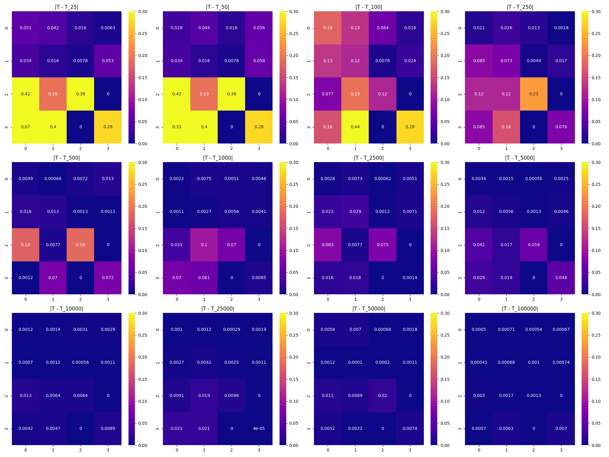

# Markov Chains for Weather Prediction

Probabilistic weather modeling using Markov chains, applied to real historical weather data from Seattle. Built as the final project for a Probabilistic Methods course.

## What it does

1. **Builds a transition matrix** from historical daily weather labels (rain, sun, snow, fog) — each entry is the conditional probability of transitioning from one state to the next.
2. **Simulates the Markov chain** for varying numbers of steps (25 to 100,000) using Monte Carlo sampling.
3. **Measures convergence** by comparing simulated transition matrices against the reference matrix derived from data, using element-wise absolute error heatmaps and the Frobenius norm.

The analysis shows how quickly the simulated distribution converges to the empirical one as the number of Monte Carlo iterations grows.

## Results

The Frobenius norm drops sharply between 250 and 2,500 iterations and stabilises beyond 25,000.

**Transition graph** (conditional probabilities from real data):



**Error heatmaps** (simulated vs. real transition matrix, 25 → 100,000 iterations):



## Running it

The notebook downloads the dataset automatically via `kagglehub` (Seattle weather dataset by [petalme](https://www.kaggle.com/datasets/petalme/seattle-weather-prediction-dataset)).

### With Nix

```bash
nix-shell pm_project.nix
# a Jupyter server starts automatically; open the URL printed in the terminal
```

### Without Nix

```bash
pip install numpy pandas matplotlib seaborn kagglehub graphviz jupyter
jupyter notebook project.ipynb
```

## Files

| File | Description |
|------|-------------|
| `project.ipynb` | Main notebook — data loading, transition matrix, simulation, analysis |
| `pm_project.nix` | Reproducible Nix dev shell (Python 3.13 + Jupyter) |
| `figures/` | Output plots: transition graph (SVG), Mermaid diagram, error heatmaps |
| `Project_Report_PM.pdf` | Written report |
